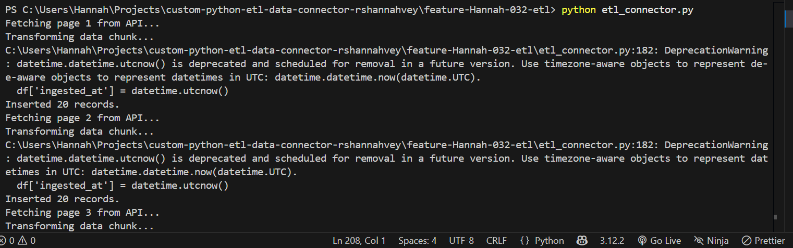
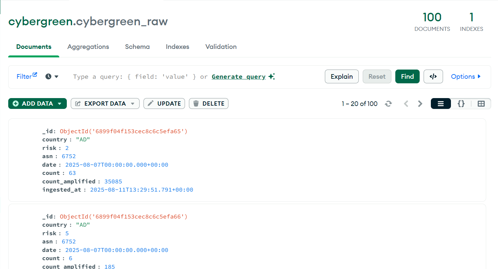

<!DOCTYPE html>
<html lang="en">
<body>
  <h1>CyberGreen ETL Connector</h1>

  <h2>Project Overview</h2>
  

    This project is an ETL (Extract, Transform, Load) pipeline that fetches CyberGreen internet health data from their public API,
    transforms the data to fit MongoDB schema requirements, and loads it into a MongoDB collection for analysis and further use.
  

  <h2>API Details</h2>
  <h3>Base URL</h3>
  <pre><code>https://stats.cybergreen.net/api/v1/</code></pre>

  <h3>Endpoint Used</h3>
  <ul>
    <li><strong>count</strong> 
      Retrieves detailed count data at the lowest granularity level. 
      Endpoint URL: <code>https://stats.cybergreen.net/api/v1/count</code>
    </li>
  </ul>

  <h3>API Parameters</h3>
  <table border="1" cellpadding="5" cellspacing="0">
    <thead>
      <tr>
        <th>Parameter</th>
        <th>Description</th>
        <th>Example</th>
      </tr>
    </thead>
    <tbody>
      <tr>
        <td><code>page</code></td>
        <td>Page number for paginated results</td>
        <td><code>page=1</code></td>
      </tr>
    </tbody>
  </table>

  <h2>Usage Instructions</h2>
  <h3>1. Prerequisites</h3>
  <ul>
    <li>Python 3.7 or higher</li>
    <li>MongoDB instance running locally or remotely</li>
    <li>Required Python packages listed in <code>requirements.txt</code></li>
  </ul>

  <h3>2. Setup</h3>
  <pre><code>git clone &lt;repo_url&gt;
cd &lt;repo_directory&gt;
pip install -r requirements.txt
  </code></pre>
  
Create a <code>.env</code> file in the root directory with the following variables:

  <pre><code>MONGODB_URI=mongodb://localhost:27017
MONGODB_DB=cybergreen
MONGODB_COLLECTION=cybergreen_raw
  </code></pre>
  
Adjust these values as needed based on your MongoDB setup.

  <h3>3. Running the ETL Script</h3>
  <pre><code>python etl_connector.py
  </code></pre>
  
The script will:

  <ul>
    <li>Fetch data page by page from the CyberGreen <code>count</code> API.</li>
    <li>Transform fields to appropriate data types and add ingestion timestamps.</li>
    <li>Insert data into MongoDB collection defined in <code>.env</code>.</li>
  </ul>

  <h2>Code Explanation</h2>
  <ul>
    <li><code>extract_data_in_pages()</code>: Retrieves API data page-wise, handles pagination, stops when no data remains.</li>
    <li><code>transform_data(df)</code>: Converts data types (dates, numerics), adds an <code>ingested_at</code> UTC timestamp.</li>
    <li><code>load_data_chunk(collection, df)</code>: Bulk inserts transformed records into the MongoDB collection.</li>
    <li><code>main()</code>: Coordinates connection to MongoDB and orchestrates the ETL steps.</li>
  </ul>

  <h2>Output for etl_connector.py
  </h2>
    

  
In MongoDB, documents inserted have the following structure:

 

<h2>Iterative Testing & Validation</h2>

This ETL connector includes basic iterative testing and validation steps to ensure robust data ingestion:

<ul>
  <li><strong>Invalid Responses:</strong> The code uses <code>response.raise_for_status()</code> to detect HTTP errors (e.g., 4xx, 5xx) and stop execution with clear error messages.</li>
  <li><strong>Empty Payloads:</strong> After each API call, the code checks if the <code>results</code> list is empty and terminates pagination accordingly, avoiding unnecessary API calls.</li>
  <li><strong>Connectivity Errors:</strong> Network errors during requests will raise exceptions that are caught in <code>main()</code> and logged with tracebacks for debugging.</li>
  <li><strong>Rate Limits:</strong> Since the CyberGreen API is public and currently does not require API keys or enforce strict rate limits, the code does not implement rate limit handling.</li>
  <li><strong>Consistent Insertion:</strong> The ETL pipeline transforms and bulk inserts data in manageable chunks, printing progress logs for transparency and confirming consistent insertion into MongoDB.</li>
</ul>

<h3>Conclusion</h3>

<ul>
  <li>The ETL pipeline successfully extracts CyberGreen data from their public API without requiring authentication.</li>
  <li>Data is paginated and fetched in chunks to handle large volumes efficiently.</li>
  <li>The pipeline transforms and cleans the data to match MongoDB’s schema requirements, including proper data types and timestamps.</li>
  <li>It loads the data directly into MongoDB, creating the database and collection if they don’t already exist.</li>
  <li>Basic error handling ensures the pipeline manages invalid responses, empty data, and connection issues gracefully.</li>
  <li>Since the API is public, no API key or rate limiting was needed, simplifying access.</li>
  <li>This project provides a solid foundation for developing robust ETL workflows with external APIs.</li>
</ul>

  
</body>
</html>
